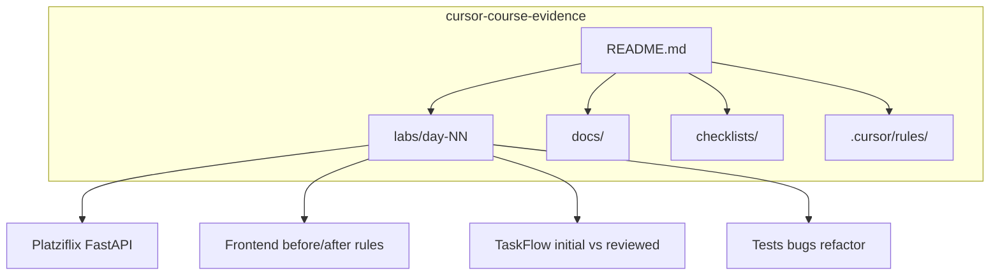

# Cursor-course-evidence

Repositorio de evidencias y laboratorios del curso de desarrollo asistido con IA a través de Cursor.

## Propósito del repositorio

Este repositorio tiene una doble naturaleza:

- **Evidencia del curso:** prompts, aprendizajes, checklists, reportes de bugs y pruebas, notas sobre MCP y reglas de Cursor.
- **Proyectos de práctica:** código generado o iterado con Cursor dentro de `labs/`. No es un repo de producción único, sino un archivo de trabajo pedagógico.

Cada carpeta `labs/day-NN` corresponde a una sesión del curso; la raíz documenta el **proceso** (cómo se trabajó con la IA), no solo el producto final.

## Objetivo del curso

El objetivo central del curso es que el participante domine la inteligencia artificial como copiloto de desarrollo. Se aborda la estructuración de proyectos, la definición de contratos técnicos y el contexto necesario para que herramientas como Cursor generen código funcional, escalable y alineado a estándares de calidad.

El enfoque es práctico: transitar de la escritura manual de código a la orquestación de agentes para construir aplicaciones completas, desde el backend con FastAPI y Docker hasta interfaces modernas con Next.js, con Cursor IDE como entorno principal.

A lo largo del curso se practican habilidades concretas:

- Dar contexto con referencias `@` a archivos, specs y reglas.
- Definir y aplicar reglas `.mdc` para orientar la generación de código.
- Planificar antes de ejecutar (revisar el plan, luego indicar cuándo aplicar cambios).
- Revisar manualmente el código generado.
- Escribir y ejecutar pruebas automatizadas.

## Proyectos de referencia en los labs

Los laboratorios usan distintos proyectos demo según el día:

| Proyecto | Ubicación | Stack | Rol en el curso |
|----------|-----------|-------|-----------------|
| **Platziflix** | [labs/day-01/Backend/](labs/day-01/Backend/) | FastAPI, PostgreSQL, Docker | Setup guiado por `specs/` paso a paso |
| **Frontend curso** | [labs/day-02/](labs/day-02/) | Next.js, TypeScript, SCSS | Comparar código generado con y sin reglas |
| **TaskFlow** | [labs/day-03/](labs/day-03/), [labs/day-04/](labs/day-04/) | Spring Boot, Java | API CRUD de tareas; día 4 = pruebas, bugs y refactor |

**Platziflix** es una plataforma online de cursos simple y directa. Cada curso contiene clases con descripciones básicas. La implementación es minimalista, enfocada en la funcionalidad core de distribución de contenido educativo. Detalle del stack, arquitectura y entidades: [labs/day-01/Backend/README.md](labs/day-01/Backend/README.md).

**TaskFlow** es un sistema pequeño de administración de tareas personales (crear, listar, actualizar estado, eliminar). Documentación del flujo técnico y revisiones: [labs/day-03/README.md](labs/day-03/README.md).

## Estructura del repositorio

```
cursor-course-evidence/
├── .cursor/rules/          # Reglas globales del proyecto (Cursor)
├── checklists/             # Progreso por día (day-01 … day-05)
├── docs/                   # Bitácora del curso
│   ├── prompts-log.md
│   ├── lessons-learned.md
│   ├── cursor-rules-notes.md
│   ├── mcp-notes.md
│   └── final-course-output.md
└── labs/
    ├── day-01/Backend/     # Platziflix + specs/
    ├── day-02/             # before-rules/ vs after-rules/Frontend
    ├── day-03/             # initial-version/ vs reviewed-version/
    └── day-04/             # source-code/, tests/, informes
```

### Contenido por día

| Día | Carpeta | Qué contiene |
|-----|---------|--------------|
| **1** | [labs/day-01/](labs/day-01/) | Backend Platziflix; contratos en [specs/00_contracts.md](labs/day-01/Backend/specs/00_contracts.md) y setup secuencial en [specs/01_setup.md](labs/day-01/Backend/specs/01_setup.md) |
| **2** | [labs/day-02/](labs/day-02/) | Mismo frontend en `before-rules/` y `after-rules/` para comparar el impacto de reglas Cursor |
| **3** | [labs/day-03/](labs/day-03/) | TaskFlow: `initial-version/` (generado con IA) y `reviewed-version/` (tras revisión humana) |
| **4** | [labs/day-04/](labs/day-04/) | Código en [source-code/taskflow/](labs/day-04/source-code/taskflow/), pruebas, [bug-report.md](labs/day-04/bug-report.md), [test-report.md](labs/day-04/test-report.md), [refactor-notes.md](labs/day-04/refactor-notes.md) |
| **5** | — | Cierre del curso: MCP, README final, [final-course-output.md](docs/final-course-output.md) (entregable pendiente de completar) |

Progreso del curso por sesión: [checklists/](checklists/) (`day-01-checklist.md` … `day-05-checklist.md`).

## Cómo usar este repositorio

### Para el participante del curso

1. **Seguir el día activo** — Abre `checklists/day-NN-checklist.md` y el lab correspondiente en `labs/day-NN/`.
2. **Dar contexto a Cursor** — Referencia con `@` los archivos relevantes: `specs/`, README del lab, reglas `.mdc`. El patrón de prompts y resultados está en [docs/prompts-log.md](docs/prompts-log.md).
3. **Planificar antes de ejecutar** — Pide un plan, revísalo y solo entonces indica que ejecute los cambios (evita sorpresas en el código).
4. **Documentar** — Registra prompts y resultados en [docs/prompts-log.md](docs/prompts-log.md); aprendizajes en [docs/lessons-learned.md](docs/lessons-learned.md).

### Para un revisor o instructor

- Los checklists muestran qué evidencias se esperan por día.
- `docs/` concentra la bitácora: qué se pidió a la IA, qué se aprendió y qué se corrigió manualmente.
- Los informes del día 4 (`bug-report`, `test-report`, `refactor-notes`) documentan un ciclo completo de prueba → fallo → diagnóstico → corrección.


## Reglas de Cursor (raíz del proyecto)

Reglas globales en [.cursor/rules/](.cursor/rules/). Resumen en [docs/cursor-rules-notes.md](docs/cursor-rules-notes.md):

| Regla | Archivo | Alcance |
|-------|---------|---------|
| Flujo general FastAPI/Python | [general-workflow.mdc](.cursor/rules/general-workflow.mdc) | Archivos `*.py` |
| Calidad de código | [code-generation.mdc](.cursor/rules/code-generation.mdc) | Proyecto |
| Documentación | [documentation.mdc](.cursor/rules/documentation.mdc) | Proyecto |
| Pruebas | [testing.mdc](.cursor/rules/testing.mdc) | Día 4 — estándares de testing |

Reglas adicionales viven **dentro de cada lab**, por ejemplo `labs/day-03/initial-version/.cursor/` o `labs/day-02/after-rules/Frontend/.cursor/rules/`.

## Documentación clave

| Documento | Contenido |
|-----------|-----------|
| [docs/prompts-log.md](docs/prompts-log.md) | Historial de prompts y resultados por día |
| [docs/lessons-learned.md](docs/lessons-learned.md) | Aprendizajes consolidados |
| [docs/cursor-rules-notes.md](docs/cursor-rules-notes.md) | Notas sobre reglas `.mdc` |
| [docs/mcp-notes.md](docs/mcp-notes.md) | MCP: qué es, cuándo usarlo, precauciones de seguridad |
| [docs/final-course-output.md](docs/final-course-output.md) | Entregable final del curso (por completar) |

## Limitaciones y buenas prácticas

- **Revisión humana:** el código generado por IA debe validarse antes de considerarse listo; los labs incluyen revisiones explícitas (p. ej. día 3: `reviewed-version/`).
- **Artefactos de build:** carpetas como `target/` (Maven) o `__pycache__/` no forman parte del diseño pedagógico; conviene no versionarlas.
- **Código mezclado por pasos:** en algunos labs puede haber implementación de pasos futuros adelantada respecto al spec actual; eso quedó documentado en [docs/prompts-log.md](docs/prompts-log.md) (día 1).

## Relación entre raíz y labs



Este README describe el repositorio completo. Para detalle técnico de cada proyecto, usa los README y `specs/` dentro de cada lab.
