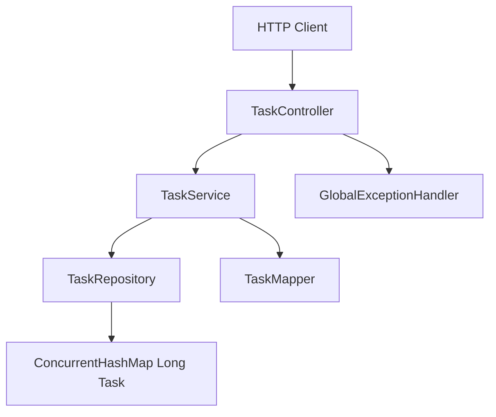

# Plan de implementación — TaskFlow (Backend)

Sistema pequeño para administración de tareas personales.
Permite crear tareas, consultar tareas registradas, actualizar estados y eliminar tareas.

## Alcance

Implementar **solo el backend** según las especificaciones. 

---

## Estructura del proyecto

Crear un proyecto Maven con Spring Boot 3.x y Java 21:

```txt
taskflow/
├── pom.xml
├── README.md                          # Documentación de la práctica
└── src/
    ├── main/
    │   ├── java/com/example/taskflow/
    │   │   ├── TaskflowApplication.java
    │   │   ├── controller/
    │   │   │   └── TaskController.java
    │   │   ├── service/
    │   │   │   └── TaskService.java
    │   │   ├── repository/
    │   │   │   └── TaskRepository.java
    │   │   ├── model/
    │   │   │   ├── Task.java
    │   │   │   └── TaskStatus.java
    │   │   ├── dto/
    │   │   │   ├── CreateTaskRequest.java
    │   │   │   ├── UpdateStatusRequest.java
    │   │   │   ├── TaskResponse.java
    │   │   │   ├── TaskSummaryResponse.java
    │   │   │   └── DeleteTaskResponse.java
    │   │   ├── mapper/
    │   │   │   └── TaskMapper.java
    │   │   └── exception/
    │   │       ├── TaskNotFoundException.java
    │   │       ├── InvalidStatusException.java
    │   │       └── GlobalExceptionHandler.java
    │   └── resources/
    │       └── application.properties
    └── test/
        └── java/com/example/taskflow/
            ├── service/TaskServiceTest.java
            └── controller/TaskControllerTest.java
```

**Dependencias mínimas en `pom.xml`:**
- `spring-boot-starter-web`
- `spring-boot-starter-validation`
- `spring-boot-starter-test` (scope test)

No agregar JPA, H2 ni otras dependencias de persistencia.

---

## Modelo de dominio

### `TaskStatus` (enum)

Valores permitidos: `PENDING`, `IN_PROGRESS`, `COMPLETED`.

### `Task` (entidad interna)

| Campo | Tipo | Notas |
|-------|------|-------|
| id | Long | Generado secuencialmente |
| title | String | Obligatorio |
| description | String | Opcional |
| status | TaskStatus | Default `PENDING` |
| createdAt | LocalDateTime | Auto al crear |
| updatedAt | LocalDateTime | Auto al crear/actualizar |

---

## Contratos JSON (snake_case)

Las especificaciones usan `created_at` y `updated_at`. Opciones:

- **Recomendada:** anotar DTOs con `@JsonProperty("created_at")` / `@JsonProperty("updated_at")`.
- Alternativa: configurar Jackson globalmente con `PropertyNamingStrategies.SNAKE_CASE` (afecta todos los campos).

Ejemplo de respuesta completa (`TaskResponse`):

```json
{
  "id": 1,
  "title": "Preparar documentación",
  "description": "Generar documentación técnica",
  "status": "PENDING",
  "created_at": "2026-05-28T10:00:00",
  "updated_at": "2026-05-28T10:00:00"
}
```

El listado (`GET /tasks`) usa un DTO distinto (`TaskSummaryResponse`) con solo `id`, `title` y `status`.

---

## Capas y responsabilidades



### 1. Repository — [`TaskRepository.java`](src/main/java/com/example/taskflow/repository/TaskRepository.java)

- Almacenamiento: `ConcurrentHashMap<Long, Task>` como `@Repository`.
- Contador atómico (`AtomicLong`) para IDs secuenciales.
- Métodos: `save`, `findById`, `findAll`, `deleteById`, `existsById`.
- Sin lógica de negocio; solo acceso a datos en memoria.

### 2. Service — [`TaskService.java`](src/main/java/com/example/taskflow/service/TaskService.java)

Reglas de negocio a implementar:

| Operación | Comportamiento |
|-----------|----------------|
| Crear | Validar título no vacío; status = `PENDING`; fechas = `LocalDateTime.now()` |
| Listar | Devolver todas las tareas como resumen |
| Detalle | Lanzar `TaskNotFoundException` si no existe |
| Actualizar status | Validar tarea existente; validar status en enum; actualizar `updatedAt` |
| Eliminar | Lanzar excepción si no existe; eliminar del mapa |

### 3. Mapper — [`TaskMapper.java`](src/main/java/com/example/taskflow/mapper/TaskMapper.java)

- `toResponse(Task)` → `TaskResponse` (detalle completo)
- `toSummary(Task)` → `TaskSummaryResponse` (listado)
- Sin dependencias de Spring; clase utilitaria estática o `@Component` simple.

### 4. Controller — [`TaskController.java`](src/main/java/com/example/taskflow/controller/TaskController.java)

| Método | Ruta | Request | Response | HTTP |
|--------|------|---------|----------|------|
| POST | `/tasks` | `CreateTaskRequest` | `TaskResponse` | 201 Created |
| GET | `/tasks` | — | `List<TaskSummaryResponse>` | 200 |
| GET | `/tasks/{id}` | — | `TaskResponse` | 200 |
| PUT | `/tasks/{id}/status` | `UpdateStatusRequest` | `TaskResponse` | 200 |
| DELETE | `/tasks/{id}` | — | `DeleteTaskResponse` | 200 |

Anotaciones: `@RestController`, `@RequestMapping("/tasks")`, `@Valid` en requests.

### 5. DTOs — carpeta [`dto/`](src/main/java/com/example/taskflow/dto/)

- **`CreateTaskRequest`:** `title` con `@NotBlank`; `description` opcional.
- **`UpdateStatusRequest`:** `status` con `@NotNull`; validar contra enum.
- **`TaskResponse`:** campos completos con snake_case en JSON.
- **`TaskSummaryResponse`:** solo id, title, status.
- **`DeleteTaskResponse`:** `{ "message": "Task deleted successfully" }`.

### 6. Excepciones — carpeta [`exception/`](src/main/java/com/example/taskflow/exception/)

| Excepción | HTTP | Body ejemplo |
|-----------|------|--------------|
| `TaskNotFoundException` | 404 | `{ "message": "Task not found with id: 99" }` |
| Validación (`@Valid`) | 400 | `{ "message": "Title is required" }` |
| Status inválido | 400 | `{ "message": "Invalid status: INVALID" }` |

`GlobalExceptionHandler` con `@RestControllerAdvice` centraliza las respuestas de error.

---

## Configuración

[`application.properties`](src/main/resources/application.properties):

```properties
server.port=8080
spring.application.name=taskflow
```

Opcional: habilitar CORS en un `@Configuration` para cuando se conecte el frontend React (fase 2).

---

## Orden de implementación (pasos concretos)

### Paso 1 — Bootstrap del proyecto
- Generar proyecto con [Spring Initializr](https://start.spring.io/) o `spring init` con Java 21, Maven, dependencia Web.
- Crear paquete base `com.example.taskflow` y subpaquetes por capa.
- Verificar que compila: `mvn clean compile`.

### Paso 2 — Modelo y enums
- Implementar `TaskStatus` y `Task` (modelo interno, sin anotaciones JSON).

### Paso 3 — Repository en memoria
- Implementar `TaskRepository` con `ConcurrentHashMap` y generación de IDs.
- Probar manualmente o con test unitario básico de persistencia en memoria.

### Paso 4 — DTOs y Mapper
- Crear todos los DTOs de request/response.
- Implementar `TaskMapper` con mapeo a snake_case.

### Paso 5 — Service con reglas de negocio
- Implementar los 5 casos de uso.
- Cubrir: título obligatorio, status inicial `PENDING`, fechas automáticas, tarea inexistente.

### Paso 6 — Controller y rutas REST
- Exponer los 5 endpoints según contrato.
- POST devuelve `201 Created`; el resto `200 OK`.

### Paso 7 — Manejo de excepciones
- Implementar excepciones custom y `GlobalExceptionHandler`.
- Unificar formato de errores JSON.

### Paso 8 — Pruebas
- **Unitarias (`TaskServiceTest`):** crear, listar, detalle, actualizar status, eliminar, tarea no encontrada, status inválido.
- **Integración (`TaskControllerTest` con `@WebMvcTest` o `@SpringBootTest`):** verificar contratos JSON y códigos HTTP.

### Paso 9 — Verificación manual con API
Probar con `curl` o REST Client:

```bash
# Crear
curl -X POST http://localhost:8080/tasks \
  -H "Content-Type: application/json" \
  -d '{"title":"Preparar documentación","description":"Generar documentación técnica"}'

# Listar
curl http://localhost:8080/tasks

# Detalle
curl http://localhost:8080/tasks/1

# Actualizar status
curl -X PUT http://localhost:8080/tasks/1/status \
  -H "Content-Type: application/json" \
  -d '{"status":"COMPLETED"}'

# Eliminar
curl -X DELETE http://localhost:8080/tasks/1
```

### Paso 10 — Documentación de la práctica
Crear [`README.md`](README.md) con:
- Cómo ejecutar (`mvn spring-boot:run`)
- Endpoints y ejemplos
- Decisiones tomadas (snake_case, in-memory, capas)
- Notas de revisión manual y posibles mejoras detectadas

---

## Criterios de aceptación

El backend estará completo cuando:

- [ ] Los 5 endpoints respondan según los contratos JSON de la especificación
- [ ] El título sea obligatorio y el status inicial sea `PENDING`
- [ ] Solo se permitan los estados `PENDING`, `IN_PROGRESS`, `COMPLETED`
- [ ] Actualizar/eliminar una tarea inexistente devuelva 404
- [ ] `created_at` y `updated_at` se generen y actualicen automáticamente
- [ ] `GET /tasks` devuelva resumen (sin description ni fechas)
- [ ] `GET /tasks/{id}` devuelva detalle completo
- [ ] `DELETE /tasks/{id}` devuelva `{ "message": "Task deleted successfully" }`
- [ ] La estructura de paquetes siga la arquitectura por capas definida
- [ ] Existan tests básicos que cubran los flujos principales

---

## Fase posterior (frontend — fuera de alcance actual)

Cuando se implemente el frontend React:

```txt
taskflow/frontend/
├── src/
│   ├── components/     # TaskList, TaskForm, TaskDetail, StatusBadge
│   ├── services/       # api.ts — cliente HTTP hacia :8080
│   ├── types/          # Task, TaskStatus
│   └── App.tsx
```

Pantallas mínimas: listado, formulario de creación, detalle con cambio de estado y eliminación. Habilitar CORS en el backend antes de integrar.

---
