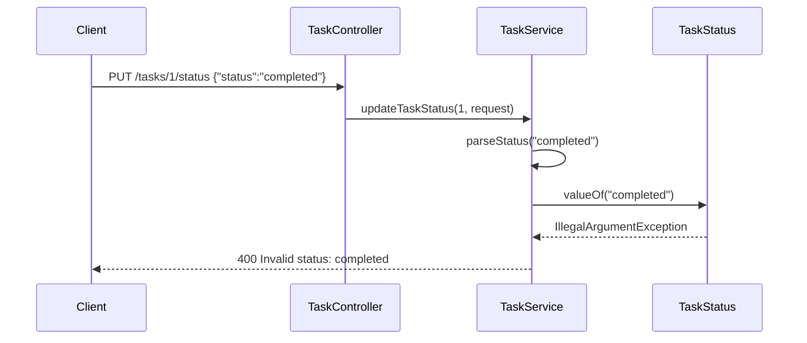

## Documentación

### 1. Error

- **Endpoint:** `PUT /tasks/{id}/status`
- **Input que falla:** `{"status":"completed"}` (valor semánticamente válido)
- **Respuesta incorrecta:** `400 Bad Request` con `{"message":"Invalid status: completed"}`
- **Contraste:** `{"status":"COMPLETED"}` respondía `200 OK` correctamente
- **Impacto:** cualquier cliente que envíe status en minúsculas o mixed case (formularios, frontends, integraciones) recibe error aunque el valor sea correcto




### 2. Diagnóstico

Proceso seguido:

1. **Reproducción manual:** levantar el servicio en `labs/day-04/source-code/taskflow` y ejecutar `POST /tasks` seguido de `PUT /tasks/1/status` con `"completed"` → confirmar 400
2. **Prueba de control:** repetir con `"COMPLETED"` → confirmar 200 (descarta problemas de routing o de tarea inexistente)
3. **Trazado en código:** seguir la cadena `TaskController.updateTaskStatus` → `TaskService.updateTaskStatus` → `parseStatus()` en TaskService.java
4. **Causa raíz identificada:** `TaskStatus.valueOf(status.trim())` es case-sensitive; el enum en TaskStatus.java solo define `PENDING`, `IN_PROGRESS`, `COMPLETED`
5. **Handler de error:** `InvalidStatusException` capturada en GlobalExceptionHandler.java → devuelve 400 (comportamiento correcto del handler; el bug está en el parseo, no en el manejo de excepciones)

### 3. Solución aplicada

- **Estrategia:** normalizar el input antes de `valueOf`, sin modificar controller, enum, DTO ni handler
- **Cambio:** una línea en `parseStatus()`:

```java
// Antes
return TaskStatus.valueOf(status.trim());

// Después
return TaskStatus.valueOf(status.trim().toUpperCase());
```

- **Comportamiento resultante:**
  - `"completed"`, `"COMPLETED"`, `"Completed"` → aceptados
  - `"invalid"`, `"INVALID"`, `null` → siguen rechazados con `InvalidStatusException` → 400
- **Test añadido:** `updateTaskStatus_acceptsLowercaseStatus` en TaskServiceTest.java

### 4. Pruebas de verificación

Documentar las tres capas de verificación ejecutadas:


| Capa                    | Acción                                                       | Resultado                          |
| ----------------------- | ------------------------------------------------------------ | ---------------------------------- |
| TDD                     | Test nuevo falló antes del fix (`Invalid status: completed`) | Confirma reproducción automatizada |
| Unitarios + integración | `mvn clean test` — 20 tests                                  | BUILD SUCCESS                      |
| Manual HTTP             | `PUT` con `"completed"` → 200; `PUT` con `"invalid"` → 400   | Comportamiento real confirmado     |


Incluir comandos reproducibles:

```bash
cd labs/day-04/source-code/taskflow
mvn clean test
mvn spring-boot:run
# curl -X PUT http://localhost:8080/tasks/1/status -H "Content-Type: application/json" -d '{"status":"completed"}'
```
